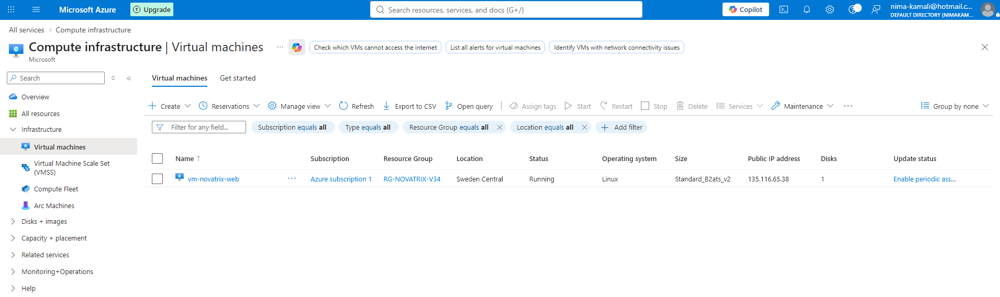
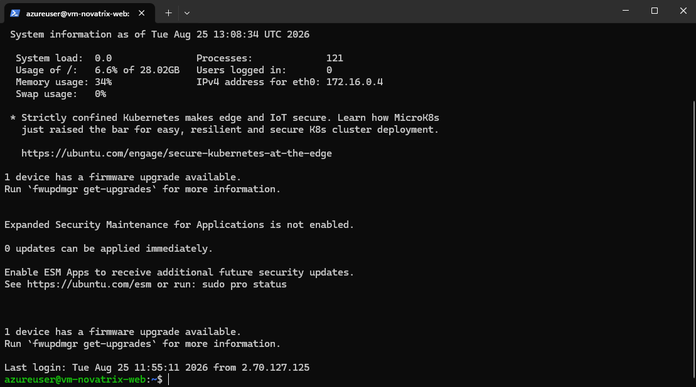
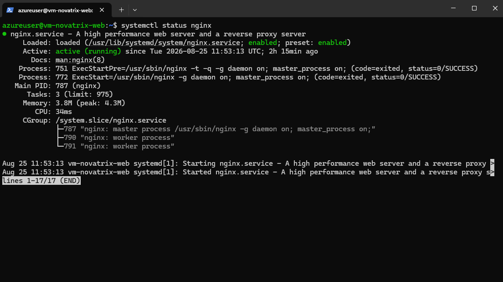

# Novatrix kundtjänst dokumentation

**Nima Kamali**

**Azure V34**

## Delmoment 2
### Skapa resursgrupp i Azure.

Prenumeration: Azure subscription 1     
Namn på resursgrupp: rg-novatrix-v34        
Region: Sweden Central      

### Skapa Virtuell Maskin i Azure
**(Inställningar som inte nämns är default)**   
Prenumeration: Azure subscription 1     
Resursgrupp: rg-novatrix-v34    
Namn på virtuell dator: vm-novatrix-web-ip  
Region: Sweden Central  
Image: Ubuntu Server 24.04 LTS - x64 Gen2   
Storlek: Standard B2ats_v2  
Namn på nyckelpar: vm-novatrix-web_key  
Välj inkommande portar: SSH (20) är redan förvald, lägg till HTTP (80)  

Granska och skapa
Skapa
Hämta privat nyckel och skapa resurs
Sparar den i ```C:\VM\Azure```
### VM nu skapad

## Delmoment 3

Öppna terminalen på fysiska datorn
Navigera till mappen SSH nyckel är i
```
C:\VM\Azure
```

Sätta behörighet på SSH nyckeln

```
icacls .\vm-novatrix-web_key.pem /inheritance:r
```

```
icacls .\vm-novatrix-web_key.pem /grant:r "$($env:USERNAME):R"
```

Anslut till VM i Azure (ip adressen hittas under "publik ip adress" i Azure för VMen)

```
ssh -i .\vm-novatrix-web_key.pem azureuser@135.116.65.38
```
Godkänn med ```yes```
### Ansluten till VM


Uppdatera severn med det senaste
Lista alla tillgängliga uppdateringar

```
sudo apt update
```

Ladda ner alla tillgängliga uppdateringar

```
sudo apt upgrade -y
```

När de senaste uppdateringarna är installerade ska NGINX installeras på servern

```
sudo apt install nginx -y
```

När den är installerad dubbelkollar vi ifall den är igång

```
systemctl status nginx
```

### nginx är running ('q' för att komma ur status vyn)
