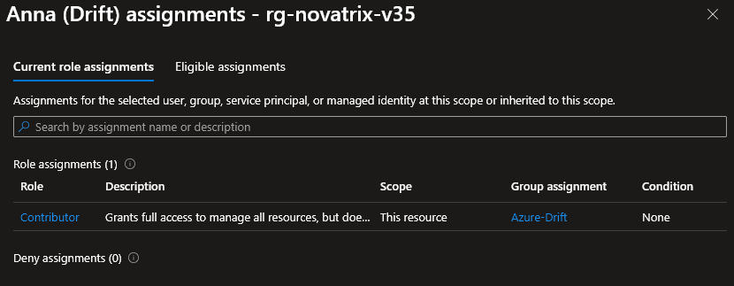
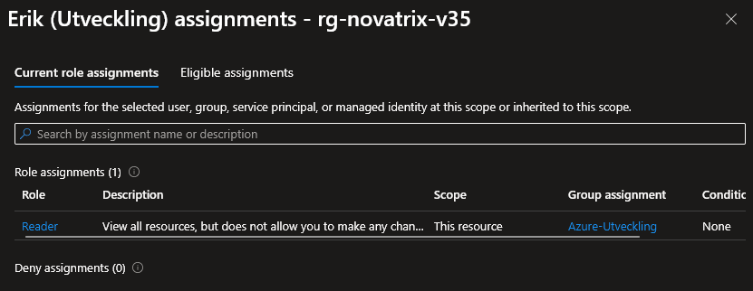
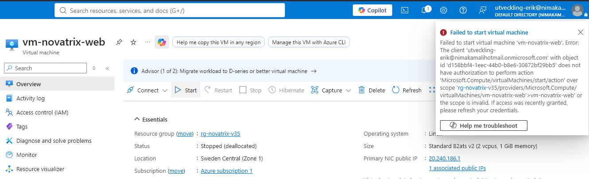

# Novatrix IAM och identitet dokumentation

**Nima Kamali**

**Azure V35**

**Repo**    
https://github.com/nima1233/azure-MOV25/tree/main/V35

## Delmoment 2
### Skapa identiteter

La till Anna (Drift) och Erik (Utveckling) som användare    

La till Drift och Utveckling säkerhetsgrupp, och la in Anna och Erik i respektive

## Delmoment 3
### Tilldela behörigheter (RBAC)

Två role assignments. Azure-Drift får contributor rollen för de sköter maskinerna. Azure-Utveckling får reader för de ska endast kunna läsa av och de behöver inte kunna skapa eller modifiera maskinerna. Scopen för dessa roller är på resursgruppen.

## Delmoment 4
### Skapa managed identity

Skapade en managed identity som kopplades till min resursgrupp.

## Delmoment 5
### Verifiera behörigheter

Har skapat två roller, contributor och reader. Dessa roller är det minsta möjliga åtkomsten de behöver för att kunna utföra deras jobb. Anna fick contributor då hon är med i drift och behöver kunna modifiera, starta eller stoppa virtuella maskiner. Erik fick reader då han är med i utveckling och behöver bara kunna läsa av.

Check access på Anna (Drift) och Erik (Utveckling)

### Erik (Utveckling) är inloggad och försöker starta VM (funkar som det ska)

