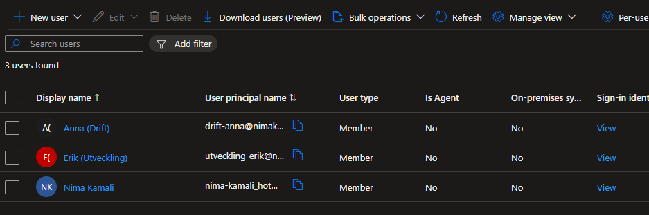
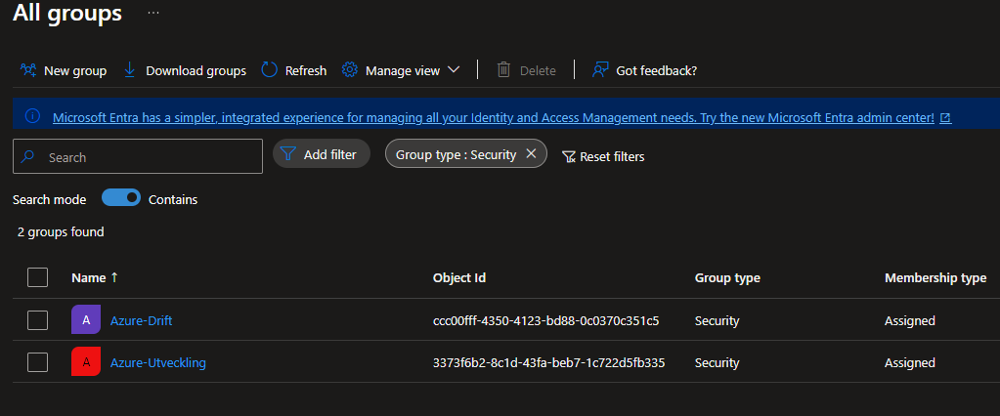
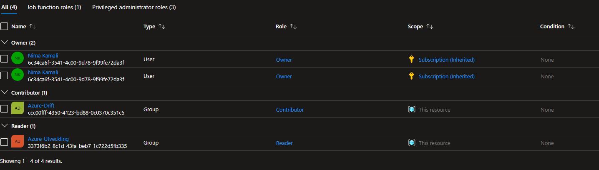
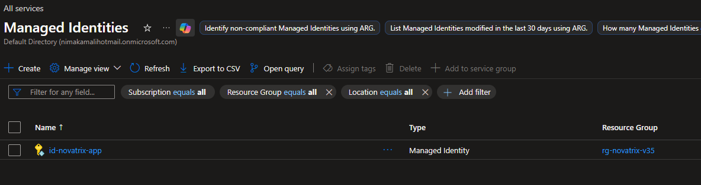

# Novatrix IAM och identitet dokumentation

**Nima Kamali**

**Azure V35**

**Repo**    
https://github.com/nima1233/azure-MOV25/tree/main/V35

## Delmoment 2
### Skapa identiteter

La till Anna (Drift) och Erik (Utveckling) som användare    

La till Drift och Utveckling säkerhetsgrupp, och la in Anna och Erik i respektive

## Delmoment 3
### Tilldela behörigheter (RBAC)

Två role assignments. Azure-Drift får contributor rollen för de sköter maskinerna. Azure-Utveckling får reader för de ska endast kunna läsa av och de behöver inte kunna skapa eller modifiera maskinerna. Scopen för dessa roller är på resursgruppen.

## Delmoment 4
### Skapa managed identity

Skapade en managed identity som kopplades till min resursgrupp.

