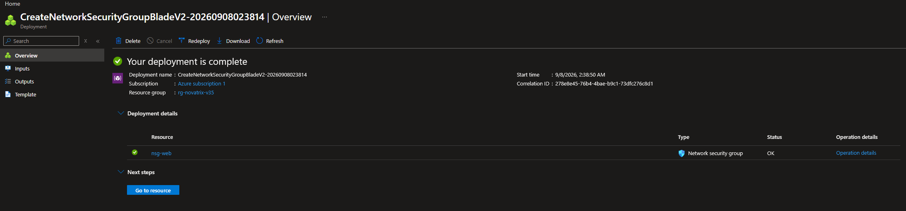
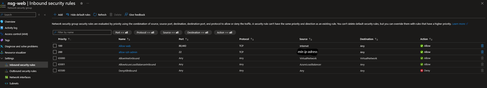

# Novatrix Nätverk och säkerhet dokumentation

**Nima Kamali**

**Azure V36**

**Repo**
https://github.com/nima1233/azure-MOV25/tree/main/V36

## Delmoment 2
### Vnet och subnät

Ett Vnet med 3 subnät för web, formulär, och ett privat förberett för lagring. Kopplat till samma resursgrupp som VM

## Delmoment 3
### NSG och begränsningar

NSG skapad, kopplad till samma resursgrupp som Vnet.

Öppna port 80 och 443 mot internet, och 22 för SSH admin endast mot min ip adress.

Koppla ihop NSG med subnätet för web som jag skapade för att lägga till dessa regler
[delmoment33](delmoment33.png)