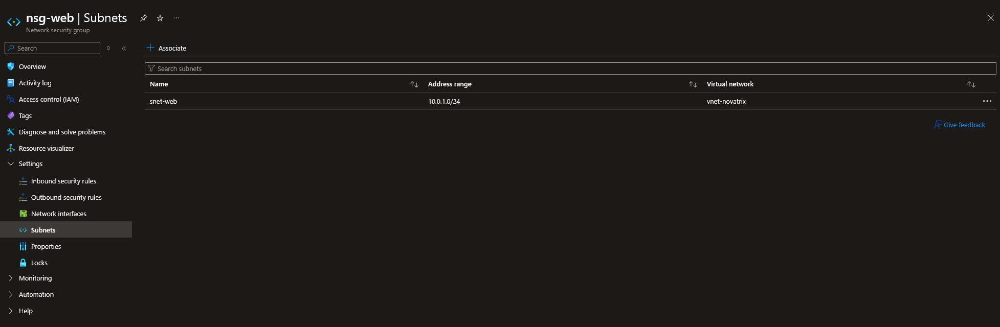
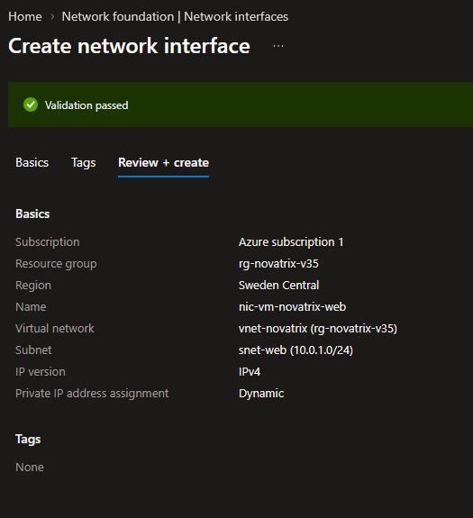
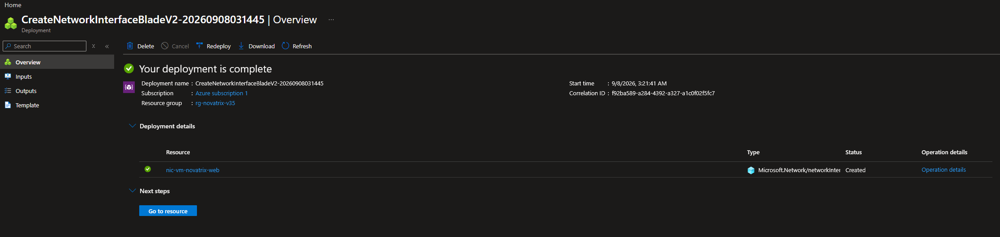
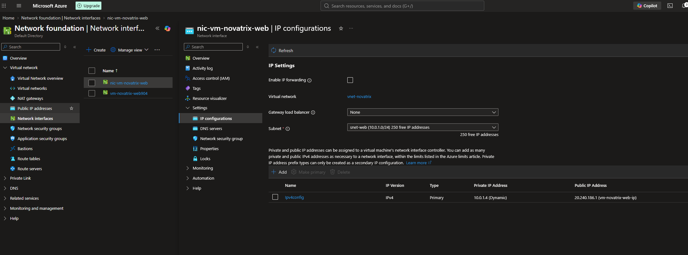
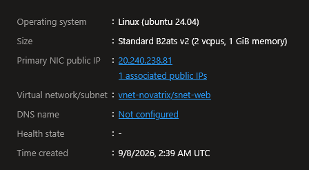
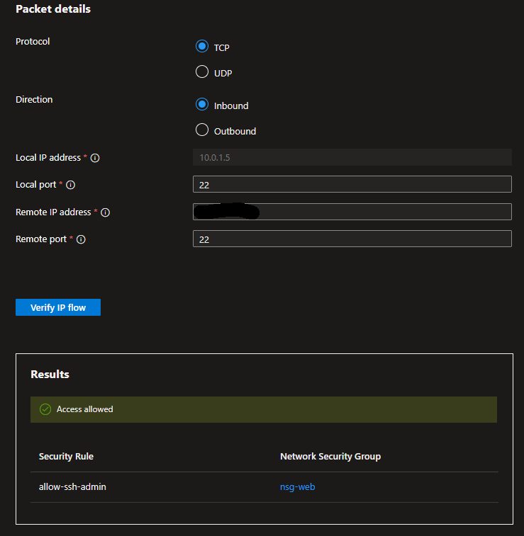
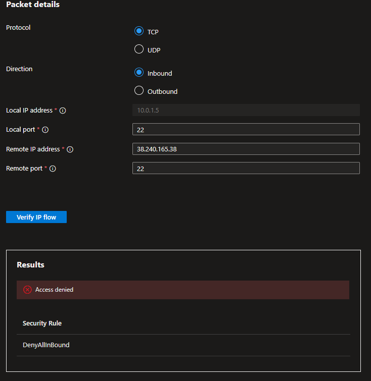
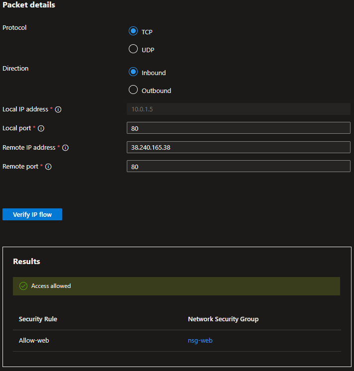
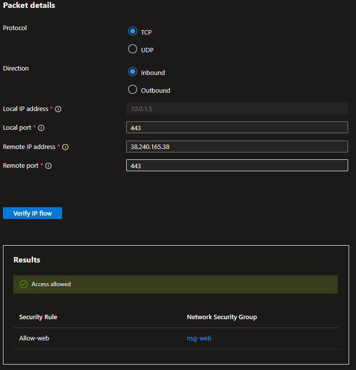
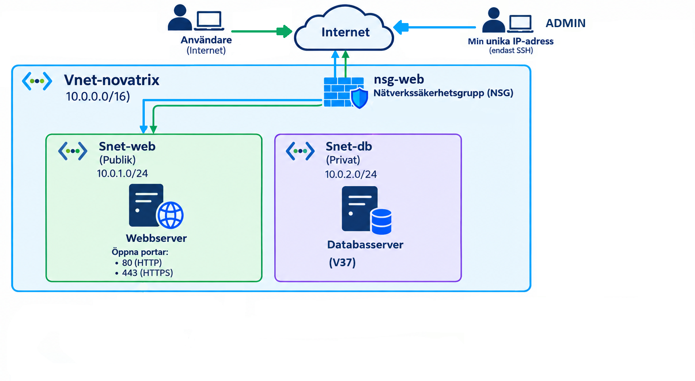

# Novatrix Nätverk och säkerhet dokumentation

**Nima Kamali**

**Azure V36**

**Repo**
https://github.com/nima1233/azure-MOV25/tree/main/V36

## Delmoment 2
### Vnet och subnät

Ett Vnet med 3 subnät för web, formulär, och ett privat förberett för lagring. Kopplat till samma resursgrupp som VM


## Delmoment 3
### NSG och begränsningar

NSG skapad, kopplad till samma resursgrupp som Vnet.


Öppna port 80 och 443 mot internet, och endast 22 för SSH admin som enbart kan nås genom min unika ip adress


Koppla ihop NSG med subnätet för web som jag skapade för att lägga till dessa regler


Skapa nytt nätverks interface som VM ska ansluta sig till, istället för default som skapades tillsammans med VM     

Ansluten till ```vnet-novatrix``` och subnätet ```snet-web```




Koppla bort publika ip adressen från default nätverk interface till den jag skapade



## Delmoment 4
### VM problem

Då Vmen inte vill ansluta till Vnet som jag skapade tar jag bort VM och återskapar den på samma disk.

VM skapad och ansluten till korrekt Vnet



## Delmoment 5
### Verifiering samt enkel skiss

Min ip adress tillåts till port 22 SSH genom ```allow-ssh-admin```



Någon annan ip adress nekas till port 22



Port 80 som är öppet mot internet



Port 443 som är öppet mot internet



Denna miljö tillämpar least privilege. Ha det minsta möjliga öppet för högre säkerhet. Genom flera lager säkerhet (defense in depth) blir det svårare och ta sig hela vägen förbi alla lager.     

Genom att dela in nätverket i olika delar genom virtuella nätverk och subnät kan man skydda känslig data ifall något skulle bli kapat. I denna situation kommer tex databasen inte ha någon koppling till internet utan bara internt, då är den extra skyddad mot hot från internet.

### Enkel skiss

