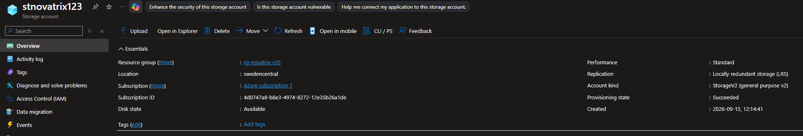
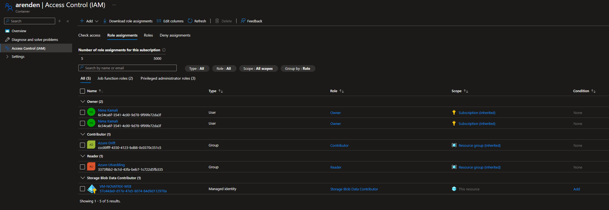

# Novatrix Storage

**Nima Kamali**

**Repo**
https://github.com/nima1233/azure-MOV25/tree/main/V37

## Delmoment 2
### Storage account

Skapar storage account ```stnovatrix123``` med primary service Azure blob storage or Azure data lake storage då vi ska jobba med blob storage. I samma resursgrupp som VMs och allt annat såklart. Det viktigaste här var att använda locally reduandant storage (LRS) och performance standard för att hålla kostnaderna nere.

### Blob container

Skapar blob container med namnet ```arenden``` och anonymous access level ska vara private för att kunna ha mer kontroll över vem som har åtkomst. Som default används nivån ```Hot``` på blob containers och det ska vi ha då åtkomst till filer här kommer att ske ofta.

### Verifiering

Här ser vi att storage container finns i rätt resursgrupp, region, samt att den har LRS redundans.




## Delmoment 4
### RBAC på storage

I stnovatrix storage går jag in i containers > arenden > Access Control (IAM) och lägger till role assignment. Viktigt att Access läggs till i containern Arenden och inte i hela storage kontot. Väljer managed identity, min VM och rollen Storage Blob Data Contributor för att VMen ska kunna ha åtkomst, skriva, och läsa. Nu har VMen dessa rättigheter till lagringen via inloggning och vi slipper jobba med någong nyckel. Detta är bättre än SAS då det är mer av en permanent lösning tillskillnad mot SAS som är mer av en temporär lösning.

### VMen har rollen Storage blob Data Contributor i arenden
