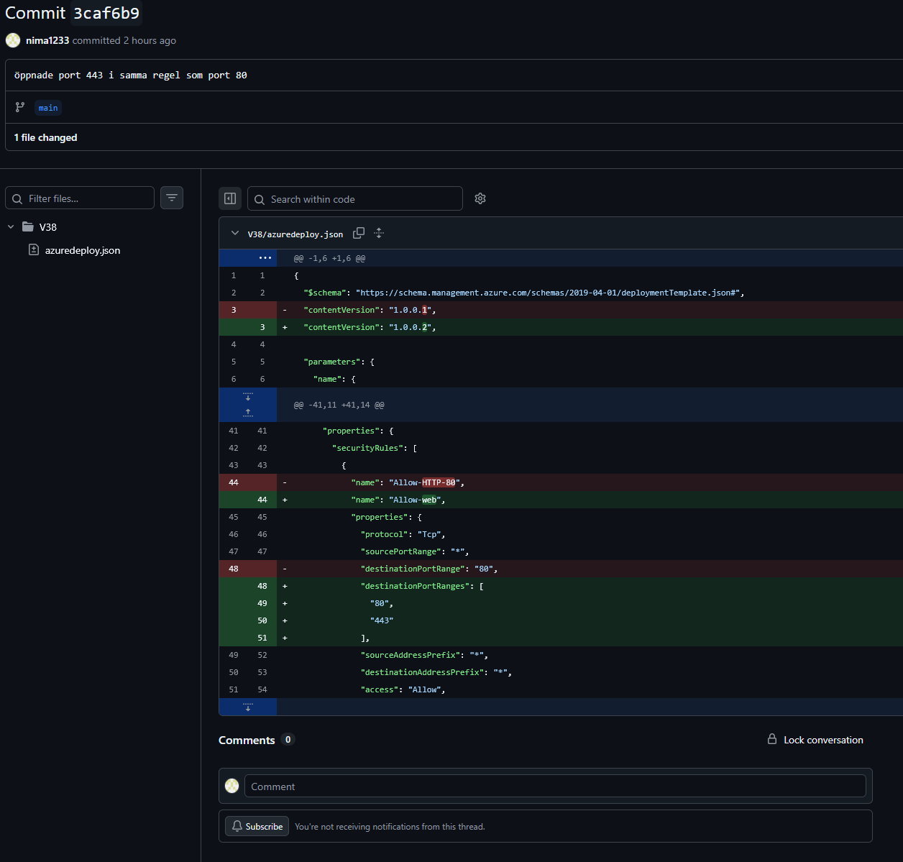
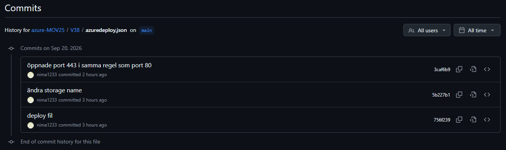
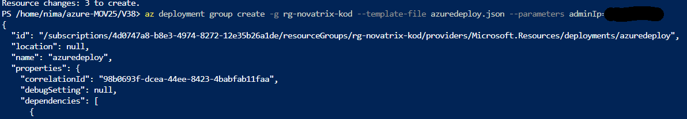
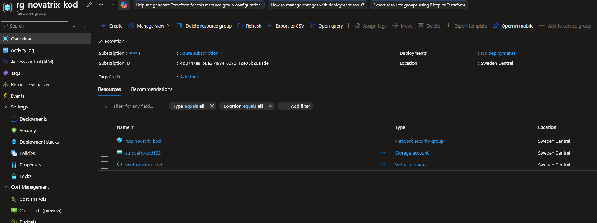
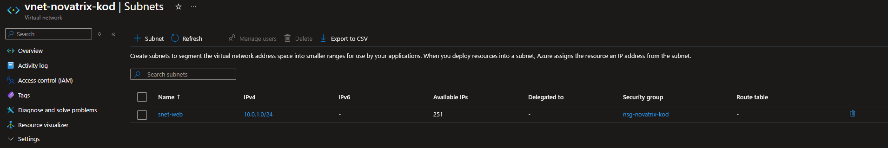

# IaC och ARM-template

**Nima Kamali**

**Repo**
https://github.com/nima1233/azure-MOV25/tree/main/V38

## Versionshantering

Här är en ändring som jag gjorde på min template. Varje ändring kan committas med ett meddelande som beskriver vad som har ändrats. Historiken gör det möjligt att se tidigare versioner och återgå till en fungerande version ifall något skulle bli fel. Samarbetar man med flera personer kan man se vem som ändrat vad och när. 

### Specifik ändring


### Historik över ändringar


## Dokumentation
### Azuredeploy

Denna template skapar upp Nätverk säkerhetsgrupp(NSG), Virtuellt nätverk med ett subnät, och ett storage account.   

NSG blir konfigurerad att öppna port 80 och 443, samt port 22 endast för admin IP som skrivs in när man deployar templaten.

### Parametrar
Namn ```novatrix-kod``` som den använder som mall för nsg, vnet, storage account    
Location ```swedencentral``` allt sätts up i swedencentral  
adminIp ```x.x.x.x``` satte som en parameter så att man fyller i den när man ska deploya. Slipper jag ha min ip adress här.

### Återskapa
1. Skapa resursgrupp som allt detta ska hamna i. Skapar denna i swedencentral    
```az group create --name rg-novatrix-kod --location swedencentral``` > ENTER       

2. Klona mitt publika repo som har template   
```git clone https://github.com/nima1233/azure-MOV25.git``` > ENTER 

3. När den klonat klart     
```cd azure-MOV25``` > ENTER    
```ls``` > ENTER    
```cd V38``` > ENTER    
```ls``` > ENTER    
Azuredeploy.json ska visas med  

4. Kör en what-if för att se att det blir korrekt (adminip för åtkomst till SSH)   
```az deployment group what-if -g rg-novatrix-kod --template-file azuredeploy.json --parameters adminIp=x.x.x.x``` > ENTER  

Kontrollera att det ser rätt ut, grön text som visar att nytt NSG sätts up, öppna port 80, 443, samt 22 endast för ipadressen som skrevs in, Vnät med subnät snet-web som ansluts till NSG, ett storage konto med namnet stnovatrixkod123, med sku standard LRS, samt att allt är i swedencentral.  

5. Deploya  
```az deployment group create -g rg-novatrix-kod --template-file azuredeploy.json --parameters adminIp=2.70.162.169```

## Verifiera




