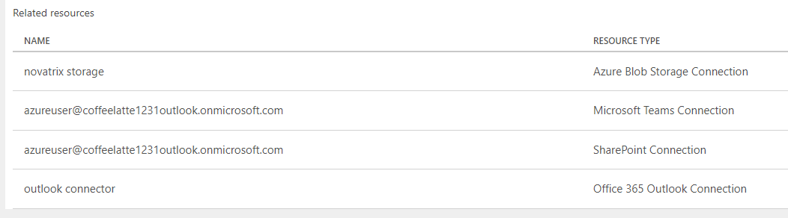
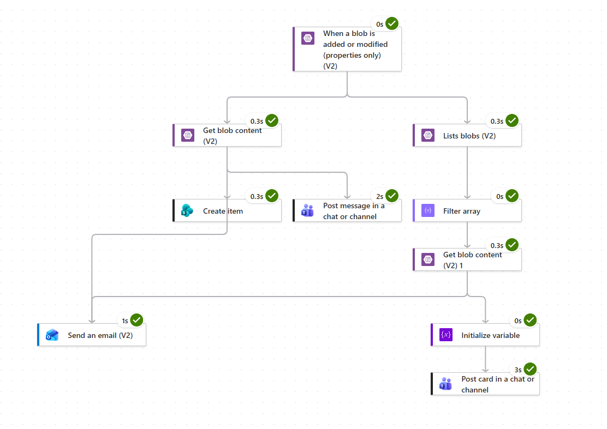
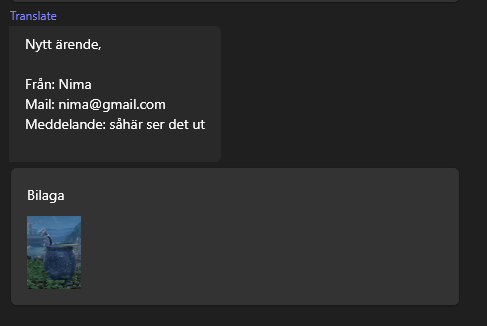
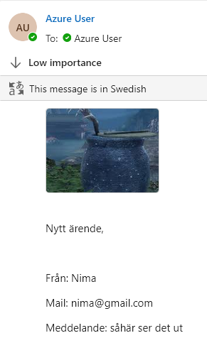
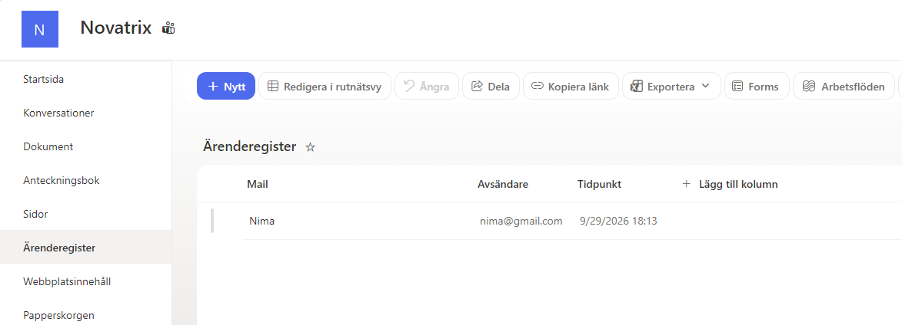

# Automation och integration

**Nima Kamali**

**Repo**
https://github.com/nima1233/azure-MOV25/tree/main/V39

## Connectors som behövs


## Hela flödet



Formuläret sparar inte i en mapp utan två separate filer, en med bilaga, och den andra som JSON för texten. När det kommer in något i blob storage triggrar den igång flödet. På triggern har jag trigger condition
````
@endsWith(triggerBody()?['Name'], '.json')
````       
Annars kan bilden triggra igång flödet först och då försöker Get blob content (V2) hämta bilden först.

### På vänstra sidan är det JSON delen. Get blob content (V2) hämtar all information som sparas som JSON i arenden.       
     
I Create Item för SharePoint, Post message in a chat or channel för Teams, och Send en email (V2) används dessa för att ta ut de information vi vill ha från Get blob content

Namn
````
@{json(body('Get_blob_content_(V2)'))?['name']}
````
Mail
````
@{json(body('Get_blob_content_(V2)'))?['mail']}
````
Meddelande
````
@{json(body('Get_blob_content_(V2)'))?['message']}
````

### I Send en email (V2) ska bilden bifogas med texten. Under Advanced parameters bockas "Attachments" i.       
Name - 1
````
@{first(body('Filter_array'))?['Name']}
````
Content - 1
````
@{body('Get_blob_content_(V2)_1')}`
````


### På högra sidan är det bild delen. Lists blods (V2) kollar igenom containern arenden. Filter array listar allt som finns i arende containern och filtrerar med detta     

````
@startsWith(@{item()?['Name']},@{replace(
    replace(
      triggerBody()?['Name'],
      'arende-',
      ''
    ),
    '.json',
    ''
  )})
````
Exempel på hur JSON filerna sparas i blob container:        
````arende-20260929T140045Z-be2318d2.json````       
Exempel på bild som sparades i samma ärende:       
````20260929T140045Z-be2318d2-Untitled.png````

Filter array tar den JSON fil som triggrar flödet, tar bort "arende-" och ".json" sen kontrollerar ifall bilden ````20260929T140045Z-be2318d2-Untitled.png```` startar med ````20260929T140045Z-be2318d2```` vilket den gör och det blir vår output.        

Get blob content (V2) 1 som kommer efter filter array använder 
````
first(body('Filter_array'))?['Id']
```` 
vilket tar den första matchningen och ger oss den bild som tillhör JSON filen. I send an email (V2) används Get blob content (V2) 1 för att attacha bilden med mailet.    

Initialize variable denna behövs för att kunna skicka bilden till Teams kanalen. Skapade SAS token för arende containern och använde den här. Value här är:     
````
concat(
  'https://stnovatrixkod123123.blob.core.windows.net/arenden/',
  first(body('Filter_array'))?['Name'],
  '?MIN_SAS_TOKEN'
)
````
För post card in a chat or channel väljer jag Team och Channel och lägger in detta i Adaptive Card: 
````{
  "type": "AdaptiveCard",
  "$schema": "http://adaptivecards.io/schemas/adaptive-card.json",
  "version": "1.4",
  "body": [
    {
      "type": "TextBlock",
      "text": "Bilaga"
    },
    {
      "type": "Image",
      "url": "@{variables('ImageUrl')}",
      "size": "Medium"
    }
  ]
}
````
Nu är SAS token inte smartaste lösningen då det är en temporär lösning men det var den lösningen jag använde för att kunna bifoga med bilden i Teams. Ska teams inte få bilden bifogat kan jag skippa hela den delen med SAS token, samt ta bort initialize variable, och post card in chat or channel.       

Denna kedja kan utökas, genom tex;  
Bekräftelse mail till personen som skickar in ärendet att det har mottagits      
Generera ticket number och ha med den i Outlook, SharePoint, Teams  
Lägga till Status i SharePoint samt skicka notiser när status ändras    
Skicka med länk i Teams till SharePoint ärendet 

Denna flow är bra grund för att kunna utöka och automatisera fler saker.

## Verifiera kedjan

### Teams


### Outlook


### Sharepoint
